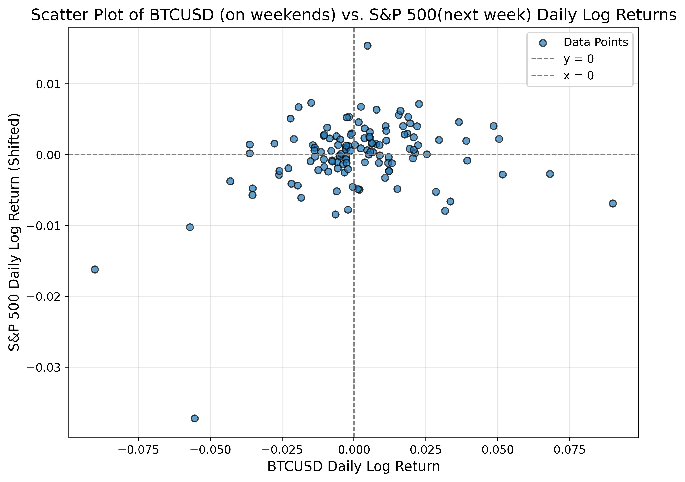

# SP500-and-Bitcoin

<div align="center">
  
</div>

## Overview
In economic theory, Adam Smith (1776) proposed that individuals pursuing their self-interest, through overall interactions, would lead to an “efficient outcome” benefiting society as a whole—a concept famously known as the “invisible hand.” Building on this idea, Eugene Fama (1965) introduced the **Efficient Market Hypothesis (EMH)**, arguing that under certain conditions, financial markets would become efficient, making it impossible for individuals to achieve excess returns. One of the key conditions Fama highlighted was the presence of a **frictionless market**, among other factors.

This project explores how close the S&P 500 market is to being frictionless by conducting a simple yet insightful experiment. Specifically, it investigates whether Bitcoin’s weekend activity—when the U.S. stock market is closed—contains useful information that could help explain the stock market's behavior at the start of a new week.

---

## Experiment Design
The experiment is designed as follows:

1. **Bitcoin's Weekend Activity**:
   - Calculated the **aggregate log return** of Bitcoin by comparing:
     - The **close price on Sunday** (the last available information before the new week’s stock market activity).
     - The **close price on Friday** (the last available information before the stock market closes).

2. **Stock Market's Weekly Activity**:
   - Calculated the **log return** of the S&P 500 by comparing:
     - The **open price on Monday morning** (new week).
     - The **close price on Friday afternoon** (previous week).

The primary objective is to determine whether the cryptocurrency market contains knowledge that could contribute to better **price discovery** for the stock market’s Monday opening activity.

---

## Data Collection
Data for this experiment was collected from **05/01/2022** to **01/09/2025**.

---

## Key Findings
- **Correlation Coefficient**: A simple correlation analysis reveals a **31.3% correlation** between Bitcoin’s weekend returns and the S&P 500’s Monday returns.
- **Sign Test**: A sign test shows that in **60.8% of cases**, the sign of Bitcoin’s weekend return aligns with the sign of the S&P 500’s Monday return. This is significantly higher than the probability of a random coin toss (50%).

---

## Conclusion
This experiment suggests that Bitcoin’s weekend activity may carry useful information that could contribute to better price discovery in the stock market at the start of a new week. While the correlation is not overwhelmingly strong, the sign test results indicate a meaningful relationship worth further exploration.

---

## Repository Contents
- **Python Code**: The accompanying Python code for this analysis is available in this repository.
- **Data**: The dataset used for this experiment is included (or referenced, if hosted externally).

---

## How to Use This Repository
1. Clone the repository:
   ```bash
   git clone https://github.com/aminaminimehr/S-P500-and-Bitcoin.git
